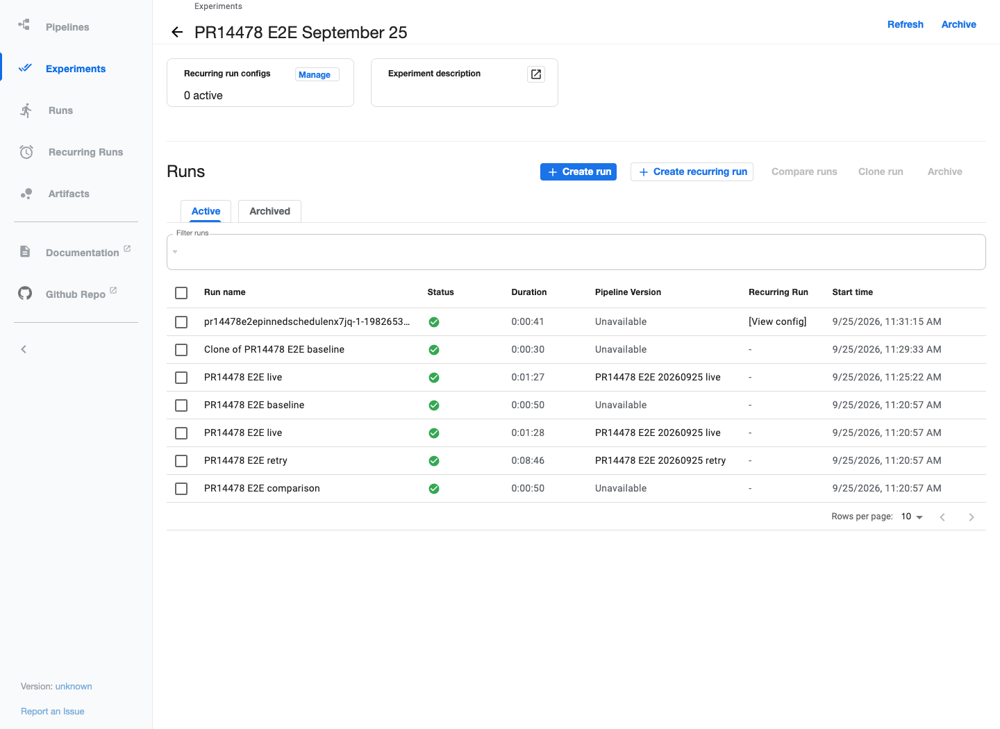
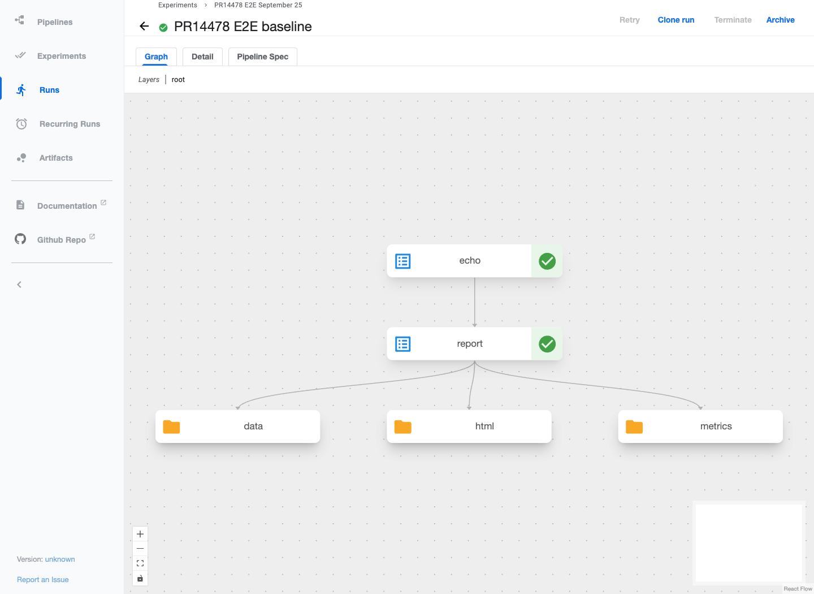
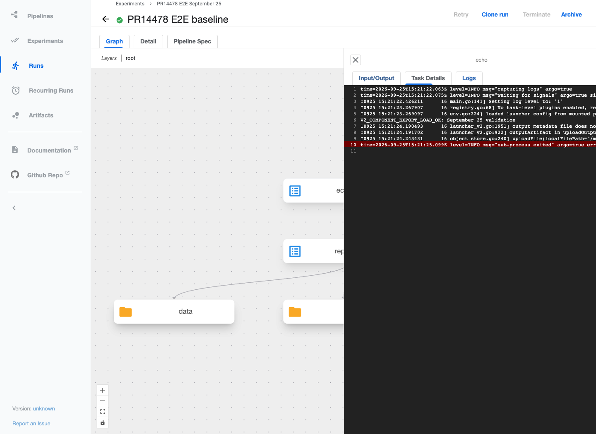
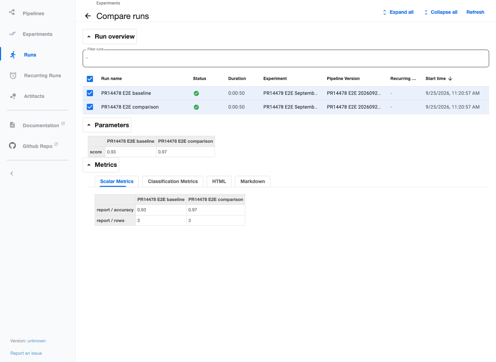
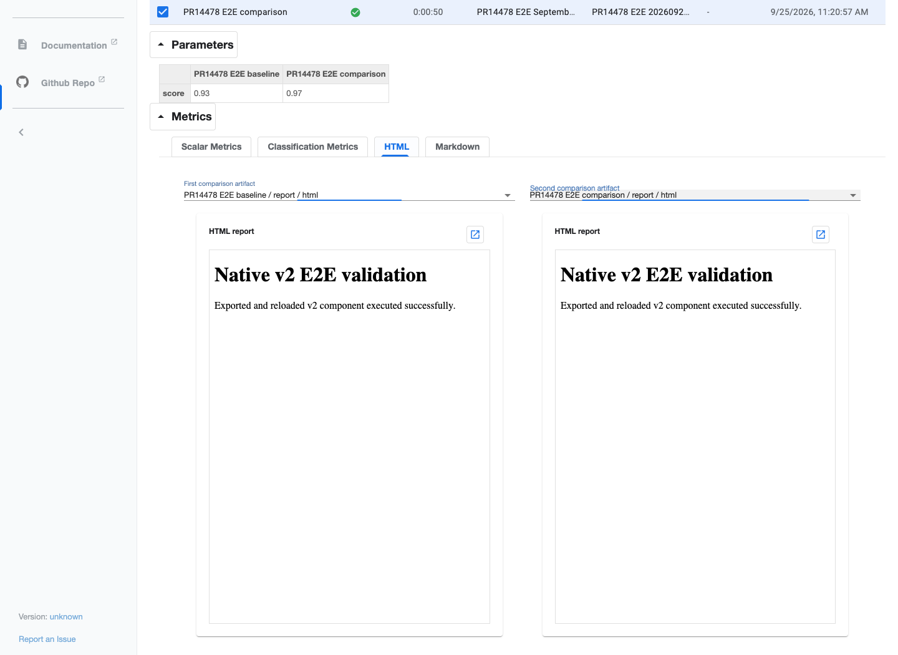
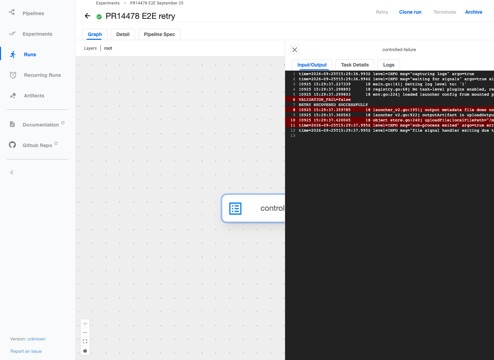
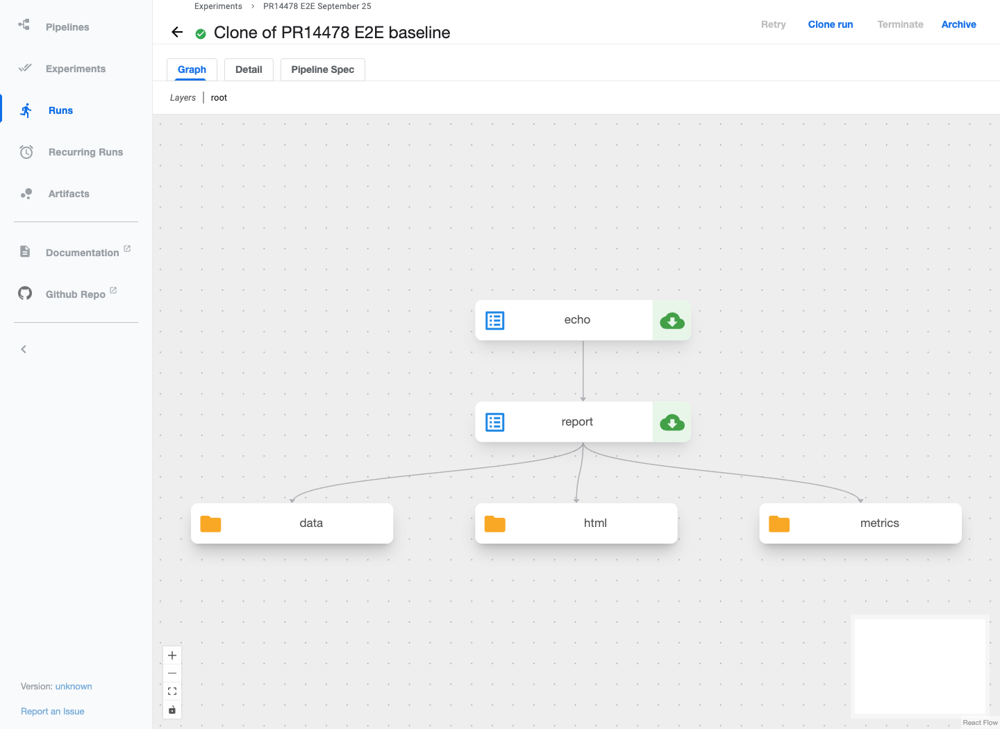
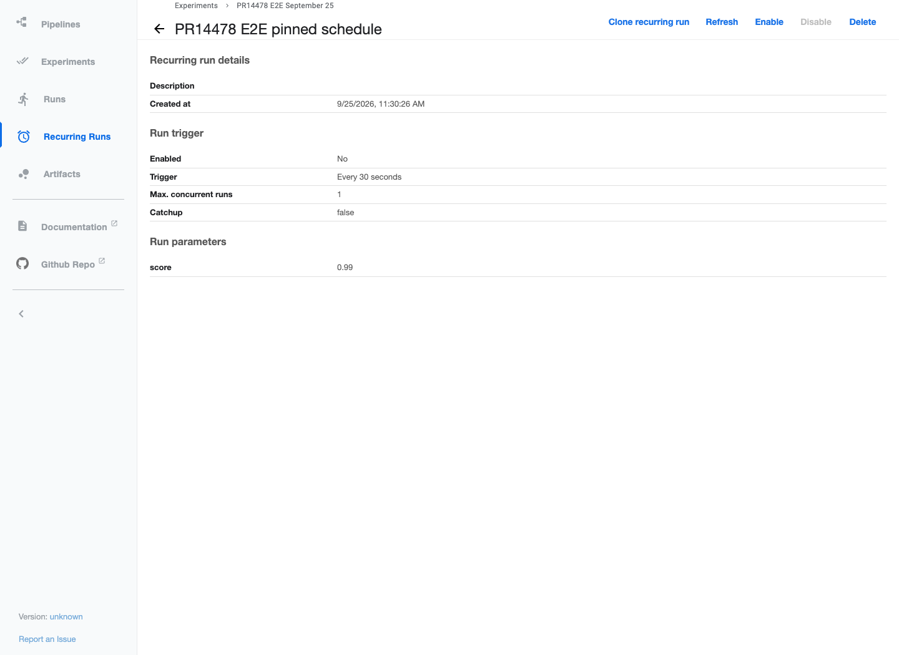

# PR #14478 — local end-to-end validation, September 25

**Result: passed within the scope below.** Seven validation runs finished
`SUCCEEDED`; the intentionally failed run was recovered through UI retry. The
validation schedule is disabled. Browser checks used real services, not mocked
API responses, and the screenshots are actual Chrome captures.

## Environment and provenance

- Context: `orbstack`; namespace: `kubeflow`; Kubernetes `v1.35.6+orb1`.
- Standalone, unauthenticated HTTP; MySQL 8.4, SeaweedFS 4.34, Argo 4.1.2.
- Validated source: `faae297e34c58fa54585cb4de42e048cb611a641`.
- All eight KFP application images were downloaded from [CI run 36148418108](https://github.com/kubeflow/pipelines/actions/runs/36148418108), built for `c390c597e8e349dbc9b7cbfa477fb12925563b8c`.
  The validated source differs only by four manifest-comment lines. A Git
  comparison confirms that backend, frontend, SDK, pipeline-spec, and Kubernetes
  plugin sources are identical. No released application image was silently
  substituted for the PR images.
- Application images are AMD64 under OrbStack emulation on an ARM64 host. The
  task runtime is a native image built locally from all four current workspace
  wheels, with `install_kfp_package=False` in the lightweight component so that
  execution uses that source-built SDK rather than reinstalling a published SDK.
- The prior local validation database and storage volumes were reused. This is
  **not** seeded production-upgrade validation.

See [source provenance](evidence/provenance.json), [loaded images](evidence/images.txt),
[deployed image identities](evidence/deployed-image-identities.json),
[resource IDs](evidence/ids.json), and [final run states](evidence/run-summary.json).

## Results

| Scenario | Observed result |
| --- | --- |
| Standalone component export/load | A `@dsl.container_component` was compiled to `echo-component.yaml`, loaded through `load_component_from_file`, composed into a v2 pipeline, and executed successfully. |
| Native parameters and artifacts | Two runs produced accuracy 0.93/0.97, row counts, CSV datasets, and HTML artifacts. Real comparison pages displayed the metrics and both HTML previews. |
| UI cloning and caching | A clone submitted through the UI completed; echo and report tasks were `CACHED`. |
| UI retry | A ConfigMap-controlled task first failed intentionally. After changing the test ConfigMap, UI confirmation of Retry recovered the same run; logs displayed `RETRY_RECOVERED_SUCCESSFULLY`. Its source version was retained during retry. |
| Live HTTP logs | A short `LIVE_STREAM_FIRST_LINE` arrived approximately **0.103 seconds** after the request, while the API still reported `RUNNING`. The client closed the stream after that line; the pod subsequently completed normally. |
| Recurring execution | A pinned 30-second test schedule created a run that succeeded. The schedule was then disabled and confirmed `mode=DISABLE`, `status=DISABLED`. |
| Deleted-version run history | After deleting the main validation version, its endpoint returned 404 while `getRun(view=FULL)` returned saved IR. Real UI requests used that fallback, and graphs and task logs remained visible. |
| Deleted-version schedule details | The disabled schedule's detail page and Enable control remained visible. Re-enabling after deletion was **not** attempted. |
| Removed formats | The current SDK rejected legacy container YAML; raw Argo upload returned HTTP 400 with migration guidance; the v1 health endpoint returned 404. |
| Browser stability | The final graph/log/clone/schedule/run-list pass recorded no page errors. Expected deleted-version 404s are preserved in the network evidence. |

[Initial API checks](evidence/submit-and-check.log) ·
[Lifecycle checks](evidence/lifecycle-check.log) ·
[Browser checks](evidence/browser-validation.log) ·
[Final browser checks](evidence/browser-final.log) ·
[Live stream timing](evidence/live-stream.json) ·
[Network observations](evidence/final-browser-network.json)

## Screenshots

### Successful validation runs and disabled scheduling



### Run graph recovered after deleting its pipeline version



### Exported/reloaded component logs, after version deletion



### Native metrics comparison



### Both HTML artifacts rendered



### Successful retry through the UI



### Cached UI clone



### Disabled recurring schedule



Additional screenshots include the original graph, pre-retry failure, clone
form, scheduled run, and completed live-log task.

## Reproduction

These scripts were run from `docs/validation/pr-14478-20260925` within the full
Pipelines checkout. The evidence branch is a report, not a standalone KFP source
checkout. Repeating setup should use fresh experiment/pipeline/ConfigMap names;
the retained main pipeline version has intentionally been deleted.

1. Start OrbStack, explicitly select its Docker/Kubernetes contexts, and load the
   application archives using `load-images.sh`.
2. Build all four workspace wheels with `uv build --all-packages --wheel`, then
   build `runtime/Dockerfile` with those wheels in `runtime/wheels`.
3. Render/apply `deployment/kustomization.yaml` from the full source checkout,
   selecting the local image tags, and wait for service readiness.
4. Forward the API and UI on localhost only:

   ```sh
   kubectl --context orbstack -n kubeflow port-forward --address=127.0.0.1 svc/ml-pipeline 8888:8888
   kubectl --context orbstack -n kubeflow port-forward --address=127.0.0.1 svc/ml-pipeline-ui 8080:80
   ```

5. Compile `validation_pipelines.py`, create the test retry ConfigMap with
   `fail=true`, then run `submit-and-check.py`.
6. Change that test ConfigMap to `fail=false` and run `browser-validation.cjs`.
7. Run `lifecycle-check.py`, then `browser-final.cjs`.

The scripts use the source-installed SDK, `requests`, `kubectl`, the repository's
Playwright dependency, and installed Google Chrome. The initial harness needed
three corrections: selecting pods by the actual `pipeline/runid` and pod-role
labels, confirming the UI retry dialog, and distinguishing recurring-run
`mode=DISABLE` from `status=DISABLED`. Corrected runs passed; no application code
was changed during this validation.

## Limits and cleanup

- This validates a small native-v2 workload and selected browser lifecycles, not
  every E2E scenario or all historical user data.
- Multi-user authorization, TLS deployment, PostgreSQL, seeded database upgrades,
  TensorBoard event rendering, GPU/DRA workloads, and abnormal upstream-log
  disconnects were not exercised in this local pass. HTTP/2/disconnect coverage
  exists in the separate automated server tests, not this standalone deployment.
- Historical v1 UI access and legacy component loading remain intentionally
  unsupported. Successful deleted-version display is not evidence that dynamic
  pod-spec-patch retries or re-enabling schedules can bypass compiler-provenance
  authorization requirements.
- The test schedule is disabled. Runs and the local deployment are retained for
  inspection; the two port-forward processes started for this pass are stopped
  after capture. Reconnect using the commands above.
- Only curated synthetic validation artifacts are published. Raw deployment
  manifests, credentials, full pod specifications, binaries/wheels, and unrelated
  local records are excluded.
